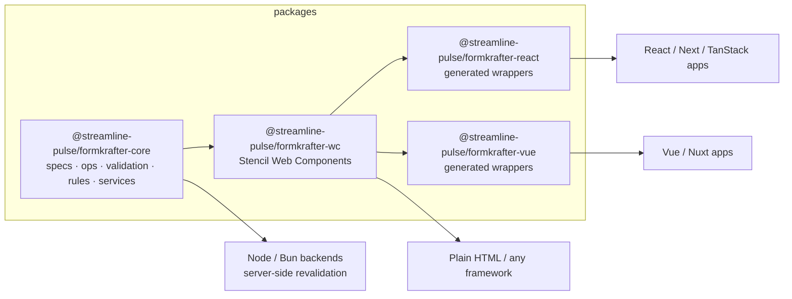

# FormKrafter

A framework-agnostic **drag & drop form builder** and **form renderer**, built once as Web Components and consumed natively from React, Vue, or plain HTML.

Forms are described by a portable JSON **spec** — the single contract shared by the builder (authoring), the renderer (filling), and your backend (revalidation).



## Packages

| Package | Role |
|---|---|
| [`formkrafter-core`](packages/core/README.md) | Pure TypeScript domain: `BrickSpec`, RFC 6902 mutation ops with undo/redo, JSON Schema validation (Ajv), a sandboxed rules engine, injectable services. Zero DOM, runs anywhere. |
| [`formkrafter-wc`](packages/wc/README.md) | The UI: `<fk-form-builder>` and `<fk-form-render>` plus 27 built-in bricks, theming tokens, i18n, drag & drop (Pragmatic DnD). |
| [`formkrafter-react`](packages/react/README.md) | React components generated from the Web Components at build time. |
| [`formkrafter-vue`](packages/vue/README.md) | Vue components generated the same way. |

## Quick taste

```tsx
import { FkFormBuilder, FkFormRender } from '@streamline-pulse/formkrafter-react'
import '@streamline-pulse/formkrafter-wc/styles.css'

<FkFormBuilder locales={['en', 'fr']} onSpecChange={(e) => save(e.detail.spec)} />
<FkFormRender  spec={spec} locale="fr" onFormSubmit={(e) => post(e.detail.data)} />
```

```ts
// and on the server, the exact same verdict:
import { validateFormData } from '@streamline-pulse/formkrafter-core'

const { valid, errors } = validateFormData(spec, req.body, 'fr')
```

## Highlights

- **One spec, everywhere** — copy/paste or download the JSON from the builder, render it anywhere, revalidate it server-side with identical rules and localized messages.
- **No `eval`** — the JS escape hatch (rules, computed options, custom validators) runs in a built-in AST sandbox: CSP-safe, no globals, no network, execution budget.
- **Theming by CSS tokens** — `--fk-*` custom properties with a built-in dark theme (`.dark` or `data-fk-theme="dark"`); restyle everything without touching JavaScript.
- **i18n on both axes** — the builder chrome ships in English and French (extensible), and form content (labels, error messages, options) supports per-locale values inside the spec.
- **Repeating data** — data grids with per-row validation, steppers and tabs with per-step validation, composite bricks (address, file upload with pluggable upload service).

## Repository layout

```
formkrafter/
├── packages/
│   ├── core/        TypeScript domain library (tsc)
│   ├── wc/          Stencil Web Components (+ dev playground)
│   ├── react/       generated React wrappers
│   └── vue/         generated Vue wrappers
├── examples/
│   └── tanstack-start/   full app: builder + preview, en/fr, dark mode
├── package.json     Bun workspaces + version catalog
└── .changeset/      release management
```

## Development

Requires [Bun](https://bun.sh).

```bash
bun install
bun run build     # builds core → wc (regenerates react/vue wrappers) → wrappers
bun run test      # core unit tests + wc headless component tests
bun run lint
```

Iterating on components:

```bash
cd packages/wc && bun run start     # dev playground on :3333 (www only, dist untouched)
bun run build                        # required before consumers see your changes
```

Running the example app:

```bash
cd examples/tanstack-start && bun run dev   # :3000
```

> After changing `packages/*`, run `bun run build` at the root **and restart** the example's dev server — Vite caches linked workspace modules.
