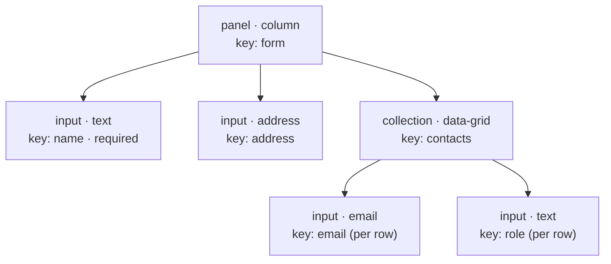
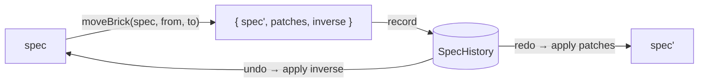

# @streamline-pulse/formkrafter-core

The framework-agnostic heart of FormKrafter: form **specs**, immutable **mutation ops**, **validation**, a sandboxed **rules engine**, and injectable **services**. No DOM, no framework — it runs in browsers, Node, Bun, and workers alike.

## The spec

A form is a tree of `BrickSpec` nodes. Each brick has a `type` (`input`, `panel`, `collection`, `output`, `action`), an `id` (which registered brick renders it), `configs` (with a unique `uid` and a data `key`), plus optional `validations`, `rules`, `styles`, and `children`.



Form data is a flat `Record<key, value>` — except inside a `collection`, where each row is its own scoped record: `{ name: 'Ada', contacts: [{ email, role }, …] }`.

## Mutating specs: ops, patches, undo

Never mutate a spec in place. Every operation returns a new spec plus RFC 6902 patches in both directions:

```ts
import { addBrick, moveBrick, removeBrick, updateBrickConfigs, SpecHistory } from '@streamline-pulse/formkrafter-core'

const update = moveBrick(spec, '0.0', '0.2.0')   // dot-paths, pre-removal coordinates
// update = { spec, patches, inverse }            // RFC 6902 both ways

const history = new SpecHistory()
history.record(update)
spec = history.undo(update.spec)                  // and .redo(), .canUndo, .canRedo
```



Available ops: `addBrick`, `removeBrick`, `moveBrick`, `duplicateBrick` (fresh uids), `updateBrickConfigs`, `updateBrickStyles`, `updateBrickValidations`, `updateBrickRules`. Addressing helpers: `getBrickAt(spec, path)`, `pointerOfUid(spec, uid)`, `iterateBricks(spec)`.

Patches are plain RFC 6902 — persist them, sync them, audit them.

## Validation

Validations live on each brick and compile to a JSON Schema (Ajv + ajv-errors + ajv-formats):

| Validator | Applies to | Parameter |
|---|---|---|
| `required` | all | — |
| `minLength` / `maxLength` / `pattern` / `email` / `url` | string | number / regex |
| `min` / `max` | number | number |
| `minItems` / `maxItems` | array | number |
| `custom` | all | JavaScript (sandboxed) |

**Backend entry point** — same verdict as the frontend, including collection rows and `''`-as-missing semantics:

```ts
import { validateFormData } from '@streamline-pulse/formkrafter-core'

const { valid, errors } = validateFormData(spec, payload, 'fr')
// errors: { name: 'Ce champ est obligatoire', 'contacts[0].email': 'Email invalide' }
```

Messages resolve in cascade: author's message (optionally localized `{ en, fr }`) → built-in localized defaults (`en`/`fr` shipped, extend with `registerValidationMessages('de', {...})`).

## Rules engine — no `eval`

Rules drive dynamic behavior (`hidden`, `disabled`, `required`, computed `value`). Two modes:

- **`jsonLogic`** (default): serializable, declarative — `{ "!": { "in": [{ "var": "country" }, ["FR","DE"]] } }`
- **`javaScript`**: the escape hatch — executed by a built-in **AST interpreter** (Acorn-based), not `eval`:
  - CSP-safe (no `unsafe-eval` needed anywhere)
  - sandboxed: only `dataMap`/`value` plus whitelisted builtins (`Math`, `JSON`, `String`, …) — no `fetch`, no `globalThis`, no `constructor`/`__proto__` escapes
  - supports expressions, ternaries, `const`/`if`/`return`, optional chaining, arrow functions (`.filter(x => …)`)
  - unsupported syntax is rejected, runaway code is cut by an execution budget

```ts
import { runSandboxed, UnsafeEvalJsRunnerService, services } from '@streamline-pulse/formkrafter-core'

runSandboxed('return items.filter((i) => i > 2)', { items: [1, 2, 3] })   // [3]

// trusted environments can opt back into full JS:
services.jsRunnerService = new UnsafeEvalJsRunnerService()
```

## Services (dependency injection points)

| Service | Default | Replace when… |
|---|---|---|
| `services.jsRunnerService` | AST sandbox | you need full JS in a trusted context |
| `services.dataSourceService` | `fetch` + per-URL/headers cache | auth, base URL, retry policy:<br/>`new FetchDataSourceService({ credentials: 'include', headers: {...} })` |
| `services.fileUploadService` | base64 data-URL | real uploads (S3, API): return `{ name, type, size, url }` |

## Localized content

Any text in a spec may be a string or a per-locale object; resolution helpers are exported:

```ts
{ "label": { "en": "Full name", "fr": "Nom complet" } }
```

`resolveLocalizedText(value, locale)`, `resolveLocalizedRecord(configs, locale)`, `isLocalizedObject(value)` — validation messages resolve through the same mechanism.
