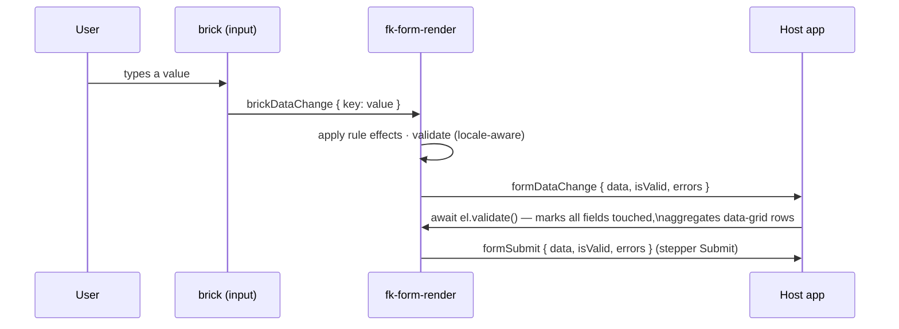
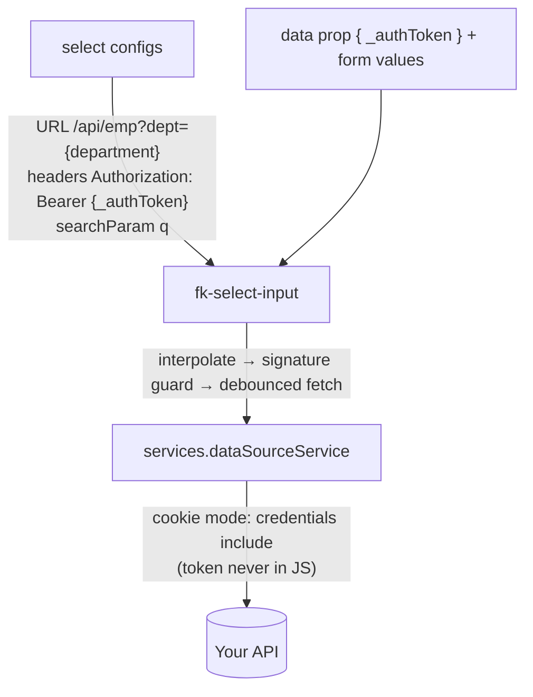

# @streamline-pulse/formkrafter-wc

The FormKrafter UI as **Stencil Web Components**: a drag & drop builder, a form renderer, and 30 built-in bricks. Framework wrappers ([React](../react/README.md), [Vue](../vue/README.md)) are generated from this package.

```html
<script type="module" src=".../formkrafter-wc.esm.js"></script>
<link rel="stylesheet" href=".../formkrafter-wc/styles.css" />

<fk-form-builder locales='["en","fr"]'></fk-form-builder>
<fk-form-render id="preview"></fk-form-render>
```

```js
import '@streamline-pulse/formkrafter-wc/styles.css'   // tokens + brick styles (opt-in)

builder.addEventListener('specChange', (e) => { preview.spec = e.detail.spec })
preview.addEventListener('formSubmit', (e) => post(e.detail.data))
```

## The builder at a glance

```
┌────────────┬────────────────────────────────┬──────────────┐
│  Palette   │  ↩ Undo ↪ Redo   ⤓ Import  ⧉ Copy │  Properties │
│  (search,  ├────────────────────────────────┤  Config      │
│  collapsible│         Canvas                │  Validation  │
│  groups)   │   drag bricks, reorder, nest   │  Styles      │
│            │   click a brick to select it   │  Rules       │
└────────────┴────────────────────────────────┴──────────────┘
```

Everything the builder does goes through core ops → **full undo/redo**, and every change emits `specChange` with `{ spec, patches, inverse }`. Specs can be exported (Copy JSON / Download) and imported (Import button or **Ctrl+V anywhere on the page**).

## Data & event flow



Underscore-prefixed keys injected via the `data` prop (e.g. `_authToken`) are available internally (interpolation, rules) but **excluded from every emitted payload**.

## Built-in bricks (30)

| Category | Bricks |
|---|---|
| **Inputs** (19) | text, email, password, url, phone, textarea, number, date, time, datetime, select, multi-select, radio, select-boxes, checkbox, tags, signature, address, code (CodeMirror, lazy-loaded) |
| **Data** (3) | file (pluggable upload, per-brick `uploadUrl`, `multiple` mode), data-grid (repeating rows, per-row validation, row reordering), hidden |
| **Layout** (8) | content, recap (live summary of the whole form), nested-form (reference another form by `specRef`), group (fieldset), row, column, stepper (wizard), tabs |

Notable behaviors:

- **select / multi-select** — searchable combobox (full WAI-ARIA pattern, keyboard navigation); options from `static`, `dataMap`, `remote` (URL + headers with `{key}` interpolation, optional server-side search param, cached), `js` (sandboxed) or `catalog` (`optionsRef` resolved through `services.optionSourceService` — store a big list once, reference it everywhere); `labelKey`/`valueKey` accept dotted paths (`name.common`). Static options accept a plain newline string when label = value.
- **data-grid** — the row template is edited like any panel; at render time each row scopes its own data; `minItems`/`maxItems` validate row counts; rows reorder with accessible up/down buttons; `validate()` reports `contacts[0].email` style keys.
- **stepper** — per-step validation gate, optional step-click jumping, optional Submit button emitting `formSubmit`. **tabs** — optional "validate tab before leaving", arrow-key navigation.
- **text / phone** — optional `prefix`/`suffix` adornments and a `mask` config (`9` digit, `a` letter, `A` uppercase, `*` alphanumeric; literals auto-inserted).
- **nested-form** — set `specRef` in its configs; at render time `fk-form-render` resolves it through `services.specSourceService` and inlines the referenced form (fields, validations, rules). See the [core README](../core/README.md#nested-forms) for `expandSpec`.
- **recap** — `groupBySections` turns labelled panels into titled sections; collections render as tables.

Register your own bricks:

```ts
import { createBrick, h, registerBrick } from '@streamline-pulse/formkrafter-wc'

registerBrick(createBrick({
  type: 'input', dataType: 'number', id: 'rating', name: 'Rating', category: 'Inputs',
  defaultConfigs: { label: 'Rating' },
  render: (props) =>
    h('div', { class: { 'fk-field': true } },
      ...[1, 2, 3, 4, 5].map((star) =>
        h('button', {
          type: 'button',
          onClick: () => props.onDataChange?.(star),
        }, '★')
      )
    ),
}))
```

`h` (and the `VNode` type) are re-exported by this package — no Stencil dependency needed in your app.

> The brick registry, the chrome translations, and core `services` are **page-wide singletons** (shared through `globalThis`, see the [core README](../core/README.md#shared-singleton-state)) — register bricks or override services once at app startup and every FormKrafter instance sees them, regardless of bundling.

## Bundle size

Measured on v0.4.0 — bundled from `dist/components` with `bun build --minify`, sizes before/after gzip:

| What you ship | Minified | Gzipped |
|---|---|---|
| Builder — includes the renderer and all 30 bricks | ~673 KB | **~214 KB** |
| Renderer only | ~630 KB | **~205 KB** |
| `styles.css` (the only stylesheet — and it's optional) | 6 KB | ~1 KB |

The code editor (CodeMirror, ~243 KB minified) is **lazy-loaded**: it never ships in the initial bundle, only when a code or rules editor actually opens. No CSS framework is required — no Bootstrap, no reset, nothing global.

## Theming

All styling flows through CSS custom properties — override them anywhere in the cascade:

| Token | Light | Dark |
|---|---|---|
| `--fk-color-primary` | `#328f97` | `#4fb8b2` |
| `--fk-color-surface` | `#ffffff` | `#111c24` |
| `--fk-color-border` | `#d5dde2` | `#2d3f4b` |
| `--fk-color-text` / `--fk-color-muted` / `--fk-color-danger` | … | … |
| `--fk-radius` / `--fk-spacing` / `--fk-font` | layout tokens | — |

Dark mode activates with the Tailwind-style `.dark` class **or** `data-fk-theme="dark"` on any ancestor — pure CSS cascade, no JavaScript, subtree-scopable. Skipping `styles.css` entirely and styling `.fk-*` classes yourself is a supported strategy.

## i18n

**Builder chrome** (palette, panel, buttons, brick names — ~90 keys):

```ts
import { setFkTranslations, frFkTranslations } from '@streamline-pulse/formkrafter-wc'

setFkTranslations(frFkTranslations)   // before mounting; re-mount to switch live
```

**Form content** (author data): any label/message/options can be `{ en, fr, … }`; pass `locale` to `<fk-form-render>` and `locales={['en','fr']}` to the builder (adds an edit-language selector, panel fields read/write per language).

The lib never sniffs the browser language — the host decides, the lib follows.

## Remote options & auth



Two supported auth patterns — they compose:

1. **httpOnly cookie** (recommended, same-origin): `services.dataSourceService = new FetchDataSourceService({ credentials: 'include' })` — nothing secret in specs or panel.
2. **Context token**: host injects `data={{ _authToken }}`; panel header reads `{_authToken}`. The `_` prefix guarantees it never leaves through emitted data.

## Development

```bash
bun run start   # playground on :3333 (theme + language toggles) — writes www/ only
bun run build   # dist + custom elements + regenerates React/Vue wrappers
bun test        # headless component tests (happy-dom) against the built dist
```
